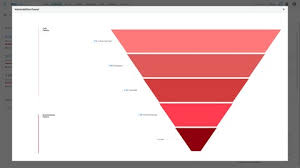

# CVE To Asset Scanner

This script is to collect the impacted assets from the CVE list from each level of the Prisma Vulnerability Funnel widget.

## Dataview in Prisma
- Login 
- Dashboards 
- Click 'More (Dashboards)' 
- Select Vulnerabilities

#### This is the vulnerability funnel
- Click the count of any of the levels
#### This is the list of CVEs
- Click any of the CVEs
- Click an asset type found (package, iac, host, etc.)
#### This table is the list the script will create

The script starts with the 'in use' category since it can have the fewest. 

## Run the script
- Python 3.11
- pip install cvs pcpi json shutil datetime

python cve_to_asset_scan.py

## Configure the script
ENABLE_CACHING = {true, false}

## Credentials
This uses the PCPI library so a json file using this structure is needed. Look for `session_managers = session_loader.load_config`
#### https://github.com/PaloAltoNetworks/prismacloud-api-python
`[
    {
        "name": "My Tenant",
        "url": "https://api.prismacloud.io",
        "identity": "**********",
        "secret": "*********",
        "verify": "true",
        "proxies": null,
        "project_flag": "false"
    }
]
`

### Long description of process
This script, for each level in the vulnerability funnel collects all the CVEs and then gets each type of asset for that CVE using the same query. These queries can be used or retireved from the investigate page in Prisma. The CVE and asset data are collected in json files and at the end of each level parsed into a CSV drawing the mapping of the CVE to the asset file and fix. The CVE list may be able to be downloaded more directly but, that API didn't work for me. It's a lot of data on the tenants I've run this against so has taken a long time to run. The primary reason for using the PCPI library is because it handles the large number of API calls and the session management. It writes the CSV for each level before proceeding to the next and the caching functionality allows for restarting in the middle of the process. The caching is not highly configurable so you should review the script if this is of concern. 

### Action Result Schema Info
- ResultStatus [ AVAILABLE, DONE ]
- Action [ suppress, createTask, createPr ]
- ActionResult [ null, *pr link* ]
- Message [ Invalid Assets, "", Fix version not available ]
